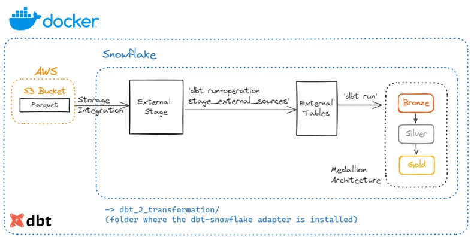

# ETL - Leveraging dbt-Snowflake to perform Transformation Step (Reading Parquet from S3 -> Storing in Snowflake External Tables -> dbt Transformation in Snowflake).



## Table of Contents

- [Project Structure](#project-structure)
- [Setup Instructions](#setup-instructions)
  - [Prerequisites](#prerequisites)
  - [Environment Variables](#environment-variables)
  - [Build and Run](#build-and-run)
- [Services](#services)
- [dbt](#dbt)

## Project Structure

- **name_of_your_project_repo (project-root)/**
    - **.devcontainer/**
      - devcontainer.json
    - **dbt_2_transformation/**   (This is where your dbt project lives)
    - **external_s3**             (S3 sign-in details, which are ignored by .gitignore)
    - **.env**
    - **.gitignore**
    - **.python-version**
    - **Dockerfile**
    - **docker-compose.yml**
    - **requirements.txt**
    - **README.md**

## Setup Instructions

### Prerequisites

Make sure you have the following installed on your local development environment:

- [Docker](https://www.docker.com/get-started)
  - PLEASE NOTE: make sure to Enable
    - Go to: `Docker Desktop > Settings > Resources > WSL integration > Click on Enable Button for Ubuntu-22.04`
- [Docker Compose](https://docs.docker.com/compose/install/)
- [VSCode](https://code.visualstudio.com/) with the [Remote - Containers extension](https://marketplace.visualstudio.com/items?itemName=ms-vscode-remote.remote-containers)

Make sure to inclue a .gitignore file with the following information:

*.pyc          (to ignore python bytecode files)
.env           (to ignore sensitive information, such as database credentials)
data/          (to ignore CSV files)
s3_stuff/      (to ignore S3 Access Keys and Credentials)
old_stuff/

### Environment Variables
The .gitignore file, ignores the ´.env´ file for security reasons. However, since this is just for educational purposes, follow the step below to include it in your project. If you do not include it, the docker will not work.

Create a `.env` file in the project root with the following content:

- JUPYTER_TOKEN=123
- S3_IAM_ROLE_ARN=arn:aws:s3:::dbt-duckdb-ingestion-s3-parquet             (you can get this from the jupiter notebook output)
- S3_ACCESS_KEY_ID=your_s3_access_key_id                                   (you can get this from S3)
- S3_SECRET_ACCESS_KEY=your_s3_secret_access_key_id                        (you can get this from S3)
- S3_REGION=your_region                                                    (you can get this from S3)
- S3_BUCKET_NAME=your_bucket_name                                          (you can get this from S3)
- S3_SNOWFLAKE_IAM_ROLE_ARN=arn:aws:iam::533267405478:role/mysnowflakerole (you can get this from the jupiter notebook output)
- S3_SNOWFLAKE_STORAGE_INTEGRATION=your_s3_integration_name                (you will create this, check jupyter notebook)
- S3_SNOWFLAKE_STAGE=your_s3_stage_name                                    (you will create this, check jupyter notebook)
- S3_SNOWFLAKE_FILE_FORMAT=your_file_format_name                           (you will create this, check jupyter notebook)

If you want to check if your Docker environment can see the environment variables, run:
* cd /workspace
* printenv (this will show if the environmental variables were loaded within the Docker container)
* printenv | grep S3 (this functions as a filter to show only the variables that contain 'S3')

### Build and Run

1. **Clone the repository:**

   ```bash
   git clone https://github.com/caiocvelasco/end-to-end-data-science-project.git
   cd end-to-end-data-science-project

2. **Build and start the containers:**

  When you open VSCode, it will automatically ask if you want to reopen the repo folder in a container and it will build for you.

**Note**: I have included the command `"postCreateCommand": "docker image prune -f"` in the **.devcontainer.json** file. Therefore, whenever the docker containeirs are rebuilt this command will make sure to delete the `unused (dangling)` images. The -f argument ensures you don't need to confirm if you want to perform this action.

### Services

* **dbt**: The Data Build Tool (dbt) for transforming data in the data warehouse.
* **Jupyter Notebook**: A Jupyter Notebook instance for interactive data analysis and for checking the models materialized by dbt.

### dbt

* dbt (Data Build Tool) is a development environment that enables data analysts and engineers to transform data in their warehouse more effectively.
* Once dbt is installed and configured, you can use it to build your dbt models, which are SQL scripts that will be materialized in your data warehouse of choice.
* Go to the `dbt_2_transformation` folder and follow the README in there.