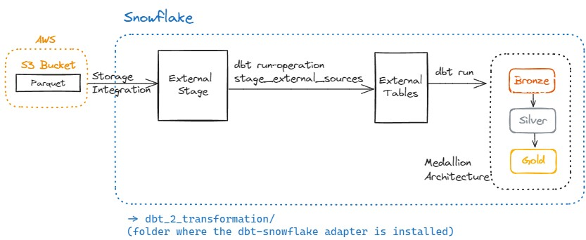

# ETL - Part 2 of 2 - Leveraging dbt-Snowflake to perform Transformation Step (Reading Parquet from S3 -> Storing in Snowflake External Tables -> dbt Transformation in Snowflake).



## Table of Contents

- [Project Structure](#project-structure)
- [Setup Instructions](#setup-instructions)
  - [Prerequisites](#prerequisites)
  - [Environment Variables](#environment-variables)
  - [Build and Run](#build-and-run)
- [Services](#services)
- [dbt](#dbt)
- [Transformation Step](#transformation-step)

## Project Structure

- **name_of_your_project_repo (project-root)/**
    - **.devcontainer/**
      - devcontainer.json
    - **.dbt**
      - profiles.yml (connection details for our database environments)
    - **analyses**
    - **dbt_packages**
    - **logs** (ignored in git)
      - dbt.log
    - **macros**
      - **tests**
        - date_format.sql (macro to ensure date columns have date format)
      - generate_schema_name.sql (this macro makes sure your database schemas' names are respected)
    - **models**
      - **bronze**
        - snowflake_external_stage.yml (dbt source file creating external tables in Snowflake)
      - **silver**
        - silver_dbt_model_1.sql
        - properties_silver.sql
      - **gold**
        - gold_dbt_model_1.sql
        - properties.sql
    - **seeds**
    - **snapshots**
    - **target** (ignored in git)
    - **tests**
    - **.env**
    - **.gitignore**
    - **dbt_project.yml**  (the main file: this is how dbt knows a directory is a dbt project)
    - **packages.yml**     (where dbt packages should be configured)
    - **package-lock.yml** (created by dbt when the 'dbt deps' is executed against the packages.yml)
    - **README.md**
    - test_snowflake.ipynb    (create to serve as a simple way to run queries against Snowflake)

## Setup Instructions

### Prerequisites

Make sure you have the following installed on your local development environment:

- [Docker](https://www.docker.com/get-started)
- [Docker Compose](https://docs.docker.com/compose/install/)
- [VSCode](https://code.visualstudio.com/) with the [Remote - Containers extension](https://marketplace.visualstudio.com/items?itemName=ms-vscode-remote.remote-containers)

Make sure to inclue a .gitignore file with the following information:

*.pyc          (to ignore python bytecode files)
.env           (to ignore sensitive information, such as database credentials)
target/        (to ignore compiled SQL files and other build artifacts that are generated when dbt runs)
dbt_packages/  (to ignore where dbt installs packages, which are specific to your local environment)
logs/          (to ignore logs)
data/          (to ignore CSV files)

### Environment Variables
For this project, we use a global `.env` file that is in the level above the `dbt_2_transformation` folder.

### Build and Run

1. **Clone the repository:**

   ```bash
   git clone https://github.com/caiocvelasco/end-to-end-data-science-project.git
   cd end-to-end-data-science-project

2. **Build and start the containers:**

  When you open VSCode, it will automatically ask if you want to reopen the repo folder in a container and it will build for you.

**Note**: I have included the command `"postCreateCommand": "docker image prune -f"` in the **.devcontainer.json** file. Therefore, whenever the docker containeirs are rebuilt this command will make sure to delete the `unused (dangling)` images. The -f argument ensures you don't need to confirm if you want to perform this action.

### Services

* **Postgres**: 
  * A PostgreSQL database instance.
  * Docker exposes port 5432 of the PostgreSQL container to port 5432 on your host machine. This makes service is accessible via `localhost:5432` on your local machine for visualization tools such as PowerBI and Tableau. However, within the docker container environment, the other services will use the postgres _hostname_ as specified in the `.env` file (`POSTGRES_HOST`).
  * To test the database from within the container's terminal: `psql -h $POSTGRES_HOST -p 5432 -U $POSTGRES_USER -d $POSTGRES_DB`
* **dbt**: The Data Build Tool (dbt) for transforming data in the data warehouse.
* **Jupyter Notebook**: A Jupyter Notebook instance for interactive data analysis and for checking the models materialized by dbt.

### dbt

dbt (Data Build Tool) is a development environment that enables data analysts and engineers to transform data in their warehouse more effectively. To use dbt in this project, follow these steps:

1. **Install dbt**: The Dockerfile and Docker Compose file will do this for you.
2. **Configure database connection**: The `profiles.yml` was created inside a `.dbt` folder in the same level as the `docker-compose.yml`. It defines connections to your data warehouse. It also uses environment variables to specify sensitive information like database credentials (which in this case is making reference to the `.env` file that is being ignored by `.gitignore`, so you should have one in the same level as the `docker-compose.yml` - as shown in the folder structure above.)
3. **Install dbt packages**: Never forget to run `dbt deps` so that dbt can install the packages within the `packages.yml` file.
4. **Run dbt**: Once dbt is installed and configured, you can use it to build your dbt models. Use the `dbt run` command to run the models against your database and apply transformations.

### Transformation Step

**Steps Summary**
The step-by-step migration will be done for one table in Bronze. Then, we need to replicate for all the other tables.

1) Ensure your **Docker** environment is ready.
  * The Dockerfile and Docker Compose file will do this for you. You just need to open the repo with VSCode (make sure to have the prerequisites, as mentioned in the `Prerequisites` section above).
  * Check if the docker's bash terminal in VSCode can retrieve the environment variables and filter them to contain the string 'POSTGRES', for example: `printenv | grep POSTGRES`

2) Ensure your **AWS** environment is ready.
  * You need to setup an AWS Account. I created a Free one: https://aws.amazon.com/free/
  * You need to create an S3 Bucket: https://docs.aws.amazon.com/AmazonS3/latest/userguide/GetStartedWithS3.html
  * I created a bucket called: `dbt-duckdb-ingestion-s3-parquet`
  * Recall: when I ran `dbt run` for the `dbt_1_ingestion` project, dbt read from PostgreSQL and saved the data in my S3 Bucket, as Parquet.

3) Ensure your **Snowflake** environment is ready.
  * You need to setup an Snowflake Account. I created a Free 30-day trial one: https://signup.snowflake.com/
  * In this project, we read from my S3 Bucket and write into Snowflake. The way I chose to do this is called Snowflake **Storage Integration**, which opens a secure connection between the Snowflake AWS Role and the AWS S3 Role.
  * The next step after Storage Integrationis to create an **External Stage** in Snowflake.
    * NOTE: Whenever you create a new External Stage, you need to update the `ExternalID` policy of the AWS role, in the "Trusted entities" part.
  * Follow this (https://docs.snowflake.com/en/user-guide/data-load-s3-config-storage-integration) and it will guide you through the following:
    * Create an IAM Policy (done in AWS).
    * Create an IAM Role (done in AWS).
    * All the following are done in the `snowflake_up_to_ext_stage.ipynb` jupiter notebook.
    * Create a Cloud Storage Integration in Snowflake.
    * Retrieve the AWS IAM User for your Snowflake Account.
    * Grant the IAM User Permissions to Access Bucket Objects.
    * Create an External Stage.
  * **Note**: the **External Tables** will be created by dbt, see below.

2) Ensure your `dbt` environment is ready.
  * Configure your `profiles.yml`.
    * `profiles.yml` is located under the `dbt_2_transformation/.dbt/` folder.
    * This repo container the necessary information in `profiles.yml` to use **Snowflake** as an adapter.
  * Organize your dbt project directory.
    * `dbt_project.yml` file:
      * Under the `models > my_dbt_project` section, include the Bronze, Silver, and Gold layers, where the `dbt_2_transformation` project will perform the transformation step.
    * `packages.yml` file:
      * It was created by me and not by dbt.
      * This file will specify the dependencies your project needs.
        * We used `dbt-utils` and `dbt_external_tables`
      * Make sure that the `dbt-utils` package is compatible with your `dbt-core` version (https://hub.getdbt.com/dbt-labs/dbt_utils/latest/)
      * Install dbt Packages:
        * `dbt clean` (to clean dependencies),
        * then `dbt deps` (this will look for the `packages.yml` file that should be in the same level as `dbt_project.yml`.)
    * `models/` folder: 
      * Contains the dbt models (i.e., SQL scripts or *.sql files) for the Bronze, Silver, and Gold layers.
      * For each layer (e.g.: `models/silver`) there is a `properties.yml` file. This file is where you specify data columns, tests, and any other property you want to ensure at each table in the schema. 
      * `models/sources/sources.yml`: Sources make it possible to name and describe the data loaded into your warehouse by your Extract-Load tool, i.e., the data from the S3 Bucker that was ingested into the Bronze (for the Bronze models). Then, `dbt` will perform the tranformation using the Bronze models are source. When referencing these "source" tables in the dbt models, make sure to use the `{{ source('source_name','table_name') }}` jinja. The Silver and Gold layer will make reference to the Bronze models by using another jinja, the `{{ ref('bronze_model_name') }}`.
        * Notice that the `source_name` is defined with the `name:` tag in the `sources.yml` file.
    * `macro/` folder:
      * Here you create macros to use in your project.
      * An example is the `macro/tests/date_format.sql`. I created this macro in a `test/` folder to ensure that the date columns have a date format.
      * To apply this test, you need to put it in the `date_tests:` section of the `properties.yml` for the respective schema.
      * Moreover, you will find a `generate_schema_name.sql` macro that makes sure that the name we chose for (for example) the bronze schema (i.e., the `bronze` name) is the one being used when the schemas are created in the Data Warehouse (Snowflake in this case).

4) Run dbt for the second dbt project (`dbt_1_transformation/`)
  * run: `cd /workspace/dbt_2_transformation`
  * run: `dbt debug` in the Docker bash terminal (this makes sure the database connection is working).
  * We are using Snowflake External Tables as a way to make reference to Parquet files in S3. Therefore, we need to run the following before doing a `dbt run` so that dbt can create the External Tables in the **existing** External Stage:
    * Run: `dbt run-operation stage_external_sources` (This will create the External Tables in Snowflake)
    * Check here: https://hub.getdbt.com/dbt-labs/dbt_external_tables/latest/
    * An official example here: https://github.com/dbt-labs/dbt-external-tables/blob/main/sample_sources/snowflake.yml
  * run: `dbt run` and dbt will materialize the Parquet files into Snowflakes's Silver and Gold schema.